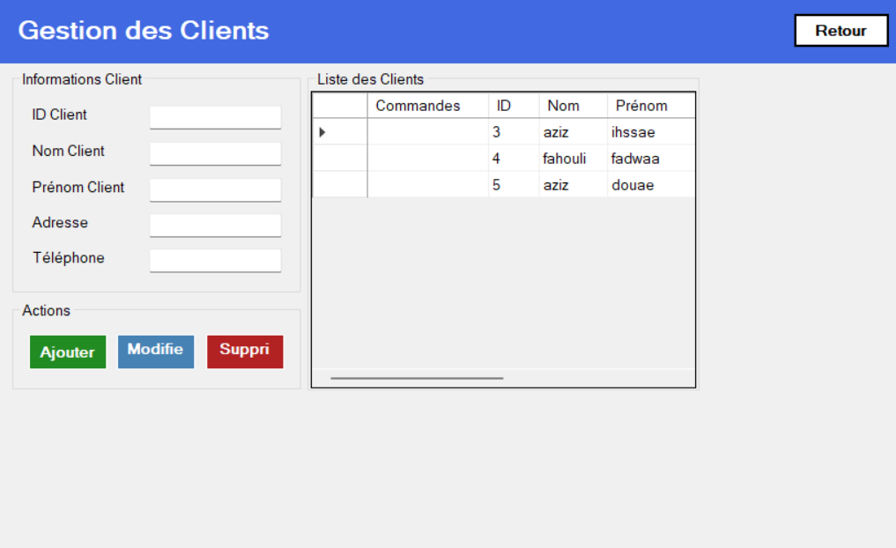
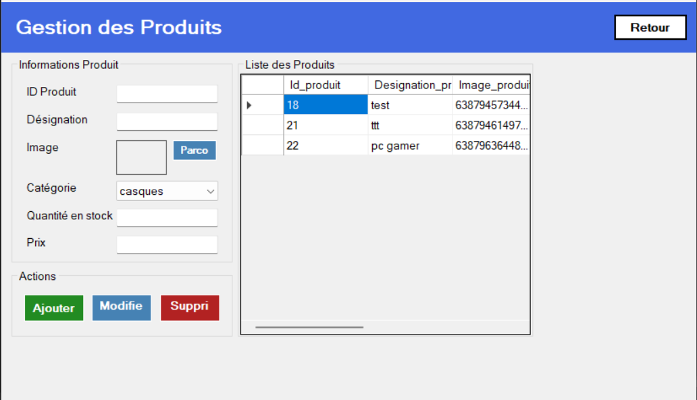
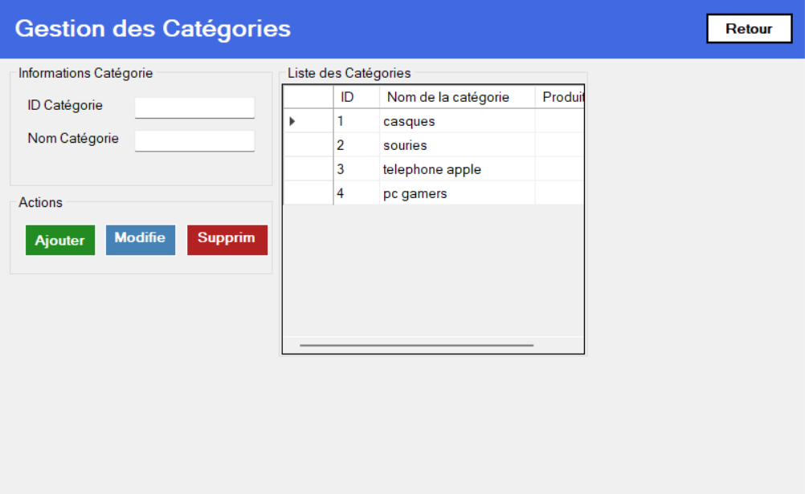
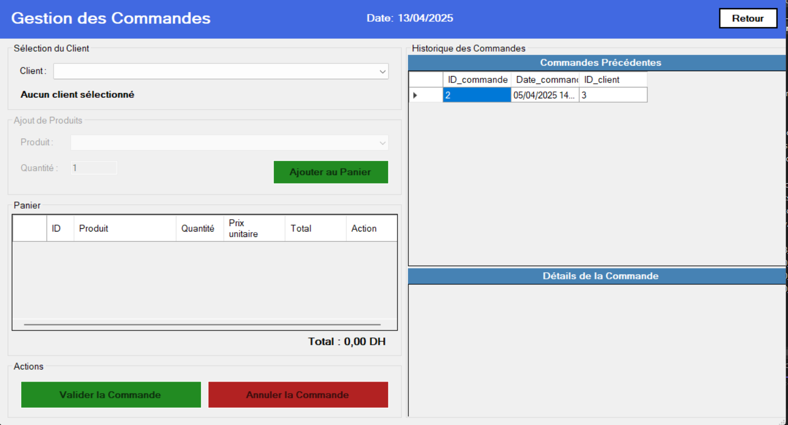

# A Sample CRUD Project Using Entity Framework

This project demonstrates a basic Create, Read, Update, and Delete (CRUD) application using Entity Framework in a .NET environment. It showcases how to interact with a database using the Code First approach.

## Features
- Add new records
- View a list of records
- Edit existing records
- Delete records

## Technologies Used
- C#
- .NET Core / .NET Framework
- Entity Framework
- SQL Server

## Getting Started
Clone the repository and run the project using Visual Studio or the .NET CLI.

---

## 📷 Screenshots

### 🏠 Home

### 👥 Clients

### 📦 Products

### 📂 Categories

### 📑 Orders

